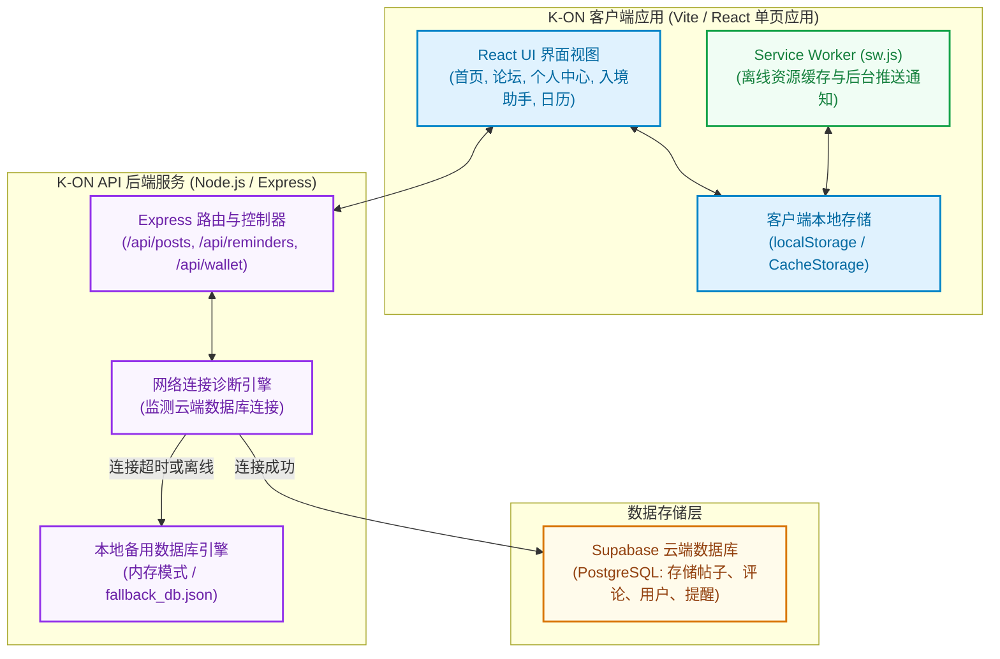
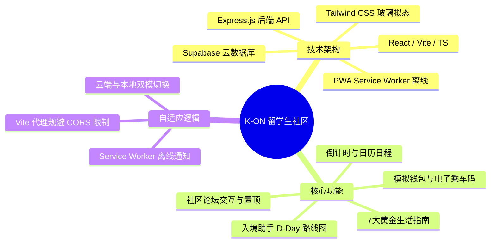
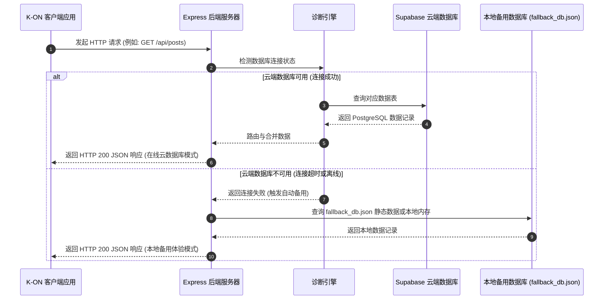

# K-ON (在韩留学生服务与社区) - 系统架构设计说明书

本文档详细阐述了 **K-ON (在韩留学生服务与社区)** 系统的整体技术架构、核心技术栈以及双模自适应数据库的设计实现。

---

## 1. 系统架构概览

K-ON 系统采用现代化的 **PWA 客户端 - API 服务端 - 数据库** 三层架构。其核心设计亮点在于**双模自适应数据库**，系统能根据网络状况和云数据库健康度，自动在“云端持久化模式”和“本地备用模式”之间进行智能切换。

### 1.2 系统功能思维脑图 (System Feature Mindmap)

通过直观的思维脑图梳理 K-ON 系统的整体模块与底层自适应交互设计：

---

## 2. 核心工作流：双模自适应数据库切换

系统在启动或接收客户端请求时，后端的诊断引擎会自动检测与云端数据库的连通性。若云端数据库由于网络波动、证书过期或未配置参数等原因无法访问，系统将以零延迟自动切入“本地备用模式”，查询本地 JSON 数据库 (`fallback_db.json`)，确保前端界面不受干扰，用户体验依然保持丝滑。

---

## 3. 技术栈细分说明

### 3.1 客户端（Frontend）
*   **Vite + React (SPA)**：采用 Vite 作为构建工具，React 构建单页应用，加载迅速，界面响应即时。
*   **渐进式 Web 应用 (PWA / Service Worker)**：
    *   通过 `sw.js` 实施“网络优先”的资源缓存策略，即便网络中断也能够正常启动应用骨架。
    *   内置 Background Push 事件监听器，接收后台代办事项通知。
*   **Tailwind CSS**：实现高饱和度与玻璃拟态（Glassmorphism）设计，包括卡片悬浮动效、色彩斑斓的图标装饰等。
*   **Lucide React**：为入境助手路线图、日程等功能模块提供统一风格的轻量化矢量图标。

### 3.2 服务端（Backend）
*   **Express.js (TypeScript)**：后端接口服务，默认监听 `5000` 端口。
*   **Vite 反向代理**：在 `vite.config.ts` 中配置反向代理规则，把所有 `/api/*` 请求转发到 Express 后端，从而完全规避跨域限制（CORS）。
*   **业务路由与控制器**：
    *   `/api/posts`：管理社区帖子的发布、喜欢、删除以及置顶。
    *   `/api/reminders`：负责留学生关键倒计时日期的保存、同步与读取。
    *   `/api/wallet`：实现模拟支付流水的划扣、支付宝与微信模拟充值。
    *   `/api/debug`：服务状态健康自检。

### 3.3 数据存储层（Storage）
*   **Supabase (云端 PostgreSQL)**：远程关系型云数据库，建有如下表结构：
    *   `users`：用户账号、密码哈希与身份标签。
    *   `posts` & `comments`：社区论坛的文章 and 评论结构。
    *   `reminders`：用户在日历模块同步的自定义闹钟日程。
    *   `wallet_logs`：存放钱包充值和支付扣款的账单日志。
*   **fallback_db.json (本地备用)**：存放初始 Mock 种子数据的文件，用于在无云端连接时充当后端的数据供应站。
*   **Client localStorage**：客户端本地持久化，用于记录用户当前登录态令牌（token）、语言偏好以及资料修改状态。
